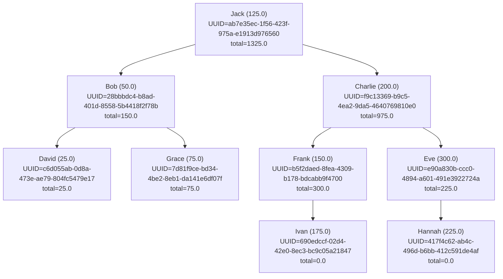

# BiTree

`BiTree` is a Haskell module providing a balanced binary tree implementation for storing and managing `Wallet` data. It includes functions to insert, delete, find minimum and maximum wallets, and print the tree structure.

## Data Structures

- `BinaryTree`: Represents a binary tree node or an empty tree.
- `Wallet`: Represents a wallet with an identifier (String) and an amount (Double).

## Functions

- `insert`: Inserts a wallet into the binary tree, maintaining balance.
- `delete`: Deletes a wallet from the binary tree, maintaining balance.
- `findMin`: Finds the wallet with the minimum amount in the tree.
- `findMax`: Finds the wallet with the maximum amount in the tree.
- `printTree`: Returns a string representation of the binary tree structure.
- `search`: Find a wallet in the binary tree based on its UUID:

## Usage

To use the `BiTree` module, import it in your Haskell source file and create a `Wallet` and `BinaryTree`:

## Example
Here is an example of how to use the BiTree module with multiple wallets and various operations:
```haskell
module Main where

import BiTree (BinaryTree(..), Wallet(..), insert, delete, findMin, findMax, printTree, search)
import Data.UUID (fromString, UUID)
import Control.Monad (foldM)

main :: IO ()
main = do
    let wallets = [ Wallet "Alice" 100
                  , Wallet "Bob" 50
                  , Wallet "Charlie" 200
                  , Wallet "David" 25
                  , Wallet "Eve" 300
                  , Wallet "Frank" 150
                  , Wallet "Grace" 75
                  , Wallet "Hannah" 225
                  , Wallet "Ivan" 175
                  , Wallet "Jack" 125
                  ]
    
    -- Insert wallets into the tree
    tree <- foldM (flip insert) Empty wallets
    
    -- Print the tree
    putStrLn (printTree tree 0)
    
    -- Find minimum and maximum wallets
    putStrLn "Minimum:"
    print (findMin tree)
    
    putStrLn "Maximum:"
    print (findMax tree)

    -- Delete a wallet from the tree
    let Node uuid1 _ _ _ _ _ = tree
    let newTree = delete uuid1 tree

    putStrLn "Tree after deleting Alice:"
    putStrLn (printTree newTree 0)
    putStrLn "Wallet 123e4567-e89b-12d3-a456-426614174000 found?:"
    let walletUUID = fromString "123e4567-e89b-12d3-a456-426614174000" :: Maybe UUID
    case walletUUID of
        Just uuid -> do
            let wallet = search uuid tree
            print wallet
        Nothing -> putStrLn "Invalid UUID"

```
This example demonstrates inserting multiple wallets into a binary tree, printing the tree structure, finding the minimum and maximum wallets, and deleting a wallet from the tree.

To run the provided Haskell script, follow these steps:

1. Save the provided code in a file with a `.hs` extension, for example, `Main.hs`.

2. Ensure you have the `BiTree` module and all necessary dependencies installed in your Haskell environment.

3. Open a terminal, navigate to the directory containing the `Main.hs` file, and run the following command to execute the script:
    ```sh
    nix-shell shell.nix
    ```
    then enter `ghci`
    ```
    ghci
    ```
    ```sh
    ghci> :l Bitree.hs
    ```
    and load `Main.hs`
    ```sh
    ghci> :l Main.hs
    ```
    then run
    ```sh
    ghci> main
    ```
This will execute the script and display the output in the terminal.
The example output would be for example: 
```
  |--Eve (300.0): UUID=f42a4d5d-b14a-484a-a39f-529cdc09d03e, total=525.0, height=2
   |--Hannah (225.0): UUID=d3c1403c-6544-4886-9117-464c6fff85b6, total=225.0, height=1
 |--Charlie (200.0): UUID=d216a440-ea23-4cd9-bf62-19fb108b7866, total=1175.0, height=4
   |--Ivan (175.0): UUID=261283ff-6476-4bef-b27a-ff62a56f9a59, total=175.0, height=1
  |--Frank (150.0): UUID=b3cc2f2c-6057-4cdf-991e-0024f10e5cd3, total=450.0, height=3
   |--Jack (125.0): UUID=7724d86a-702d-42ac-8855-c231b3ea19a5, total=125.0, height=1
|--Alice (100.0): UUID=359b77b8-d33f-49b5-a837-aeac3d6c362f, total=1425.0, height=5
  |--Grace (75.0): UUID=0237afc6-9db2-4d9f-afe1-43e1c71a53e2, total=75.0, height=1
 |--Bob (50.0): UUID=2df632b7-5626-48cc-a38e-d7198081197d, total=150.0, height=3
  |--David (25.0): UUID=ff8f4bf2-64f5-481b-a772-1d13e88da0c3, total=25.0, height=1

Minimum:
Just (Wallet "David" 25.0)
Maximum:
Just (Wallet "Eve" 300.0)
Tree after deleting Alice:
  |--Eve (300.0): UUID=f42a4d5d-b14a-484a-a39f-529cdc09d03e, total=225.0, height=1
   |--Hannah (225.0): UUID=d3c1403c-6544-4886-9117-464c6fff85b6, total=0.0, height=0
 |--Charlie (200.0): UUID=d216a440-ea23-4cd9-bf62-19fb108b7866, total=975.0, height=3
   |--Ivan (175.0): UUID=261283ff-6476-4bef-b27a-ff62a56f9a59, total=0.0, height=0
  |--Frank (150.0): UUID=b3cc2f2c-6057-4cdf-991e-0024f10e5cd3, total=300.0, height=2
|--Jack (125.0): UUID=7724d86a-702d-42ac-8855-c231b3ea19a5, total=1325.0, height=4
  |--Grace (75.0): UUID=0237afc6-9db2-4d9f-afe1-43e1c71a53e2, total=75.0, height=1
 |--Bob (50.0): UUID=2df632b7-5626-48cc-a38e-d7198081197d, total=150.0, height=3
  |--David (25.0): UUID=ff8f4bf2-64f5-481b-a772-1d13e88da0c3, total=25.0, height=1
```
Visuallly represetned it would look like this 

