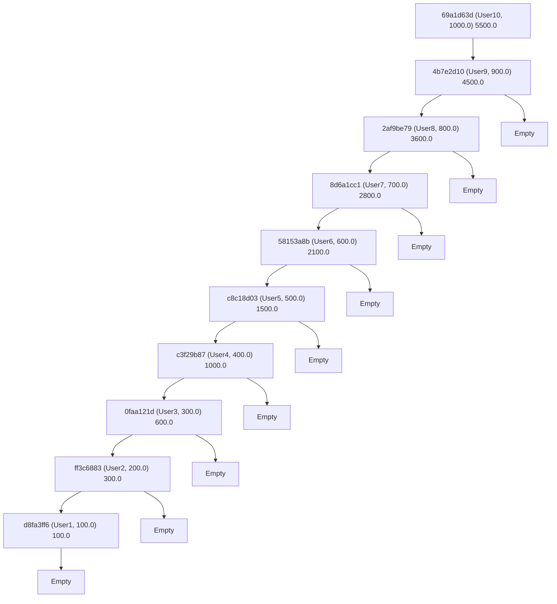

# crystallzation_trees


# UTXO on a Binary Search Tree
A UTXO (Unspent Transaction Output) in Bitcoin represents the unspent amount of bitcoin that can be used as an input in a new transaction. UTXOs are the fundamental building blocks of the Bitcoin transaction system, as they are used to transfer ownership of bitcoins from one user to another.

When a user creates a transaction in Bitcoin, they use UTXOs from their wallet as inputs and create new UTXOs as outputs. The new UTXOs are then assigned to the recipient's wallet address. The sum of the input UTXOs must be greater than or equal to the sum of the output UTXOs. If the input UTXOs' sum is greater than the output UTXOs' sum, the difference becomes the transaction fee, which is collected by the miner who includes the transaction in a block.

Each UTXO has the following properties:

1. **Transaction ID (txid):** A unique identifier for the transaction that created the UTXO. This identifier is used to reference the UTXO when it's spent in a new transaction.
2. **Index (vout):** The index of the specific output in the transaction referenced by the txid. A single transaction can have multiple outputs, and this index helps identify the correct UTXO.
3. **Value:** The amount of bitcoin associated with the UTXO, typically represented in satoshis (1 bitcoin = 100 million satoshis).
4. **Address:** The wallet address to which the UTXO belongs. The address is derived from the public key of the owner, and only the owner with the corresponding private key can spend the UTXO.

UTXOs can only be spent once. When a UTXO is used as an input in a transaction, it is considered "spent" and cannot be used again. This mechanism prevents double-spending and maintains the integrity of the Bitcoin network. The UTXO model is different from the account-based model used by some other cryptocurrencies, where balances are stored and updated in accounts, rather than relying on individual transaction outputs.
## List of UTXOs

This code is a Haskell program that reads a list of Unspent Transaction Outputs (UTXOs) from a file, filters them by a given address, and searches for a UTXO with a specific value using binary search. A UTXO is represented by the UTXO data type, which contains a transaction hash, value, and address.

# Load haskell

After installing nix, run the following command to load ghci with the help of the nix-channels:
```shell
nix-shell shell.nix
```
After entering the shell run the following command
```shell
ghci
```
Afterwards load the Main and BiTree modules
```
>ghci :l BiTree.hs Main.hs
```
And run the main function
```
ghci> main
```
The result should yield a NodeTree similar to this
```
Node 69a1d63d-3bad-4406-86e5-510912eb4519 (Wallet "User10" 1000.0) 5500.0 (Node 4b7e2d10-c319-4fbc-a871-4067c2a5542a (Wallet "User9" 900.0) 4500.0 (Node 2af9be79-03fe-4914-877f-83903607d3cb (Wallet "User8" 800.0) 3600.0 (Node 8d6a1cc1-5914-4dea-a01b-58214587b240 (Wallet "User7" 700.0) 2800.0 (Node 58153a8b-beca-40cb-9970-a627790e4323 (Wallet "User6" 600.0) 2100.0 (Node c8c18d03-7105-4e27-bb45-a049dde48dd0 (Wallet "User5" 500.0) 1500.0 (Node c3f29b87-f375-4e3d-85f5-6481a406df21 (Wallet "User4" 400.0) 1000.0 (Node 0faa121d-d8f4-48a9-9622-dab395acc428 (Wallet "User3" 300.0) 600.0 (Node ff3c6883-caee-42c8-a3e8-96fff4f147f4 (Wallet "User2" 200.0) 300.0 (Node d8fa3ff6-ec73-47cd-bfa2-244d32f978b4 (Wallet "User1" 100.0) 100.0 Empty Empty) Empty) Empty) Empty) Empty) Empty) Empty) Empty) Empty) Empty
```
and here is the visualization of the BST

