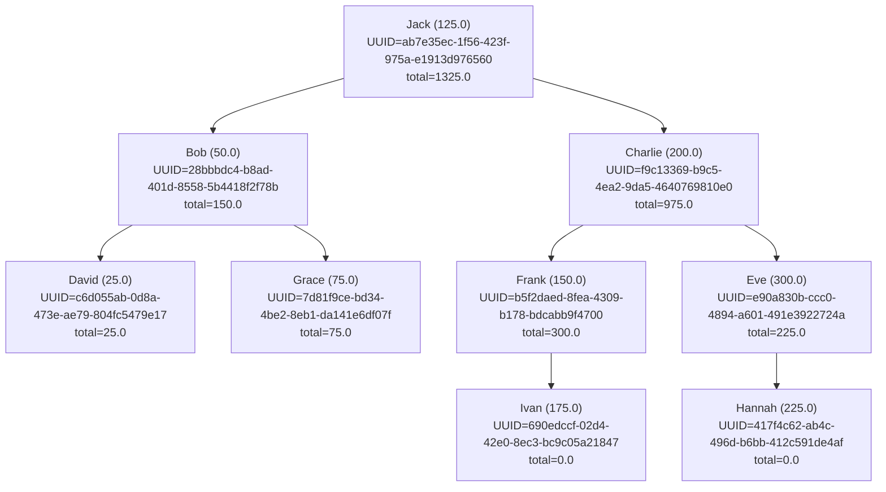

# BiTree

`BiTree` is a Haskell module providing a balanced binary tree implementation for storing and managing `Wallet` data. It includes functions to insert, delete, find minimum and maximum wallets, and print the tree structure.

## Data Structures

- `BinaryTree`: Represents a binary tree node or an empty tree.
- `Wallet`: Represents a wallet with an identifier (String) and an amount (Double).

## Functions

- `insert`: Inserts a wallet into the binary tree, maintaining balance.
- `delete`: Deletes a wallet from the binary tree, maintaining balance.
- `findMin`: Finds the wallet with the minimum amount in the tree.
- `findMax`: Finds the wallet with the maximum amount in the tree.
- `printTree`: Returns a string representation of the binary tree structure.
- `search`: Find a wallet in the binary tree based on its wallet name.
- `modify`: Modifes a wallet balance in the binary tree based on its wallet name. 

## Usage

To use the `BiTree` module, import it in your Haskell source file and create a `Wallet` and `BinaryTree`:

## Example
Here is an example of how to use the BiTree module with multiple wallets and various operations:
```haskell
module Main where

import BiTree
import Control.Monad (forM_, forM)
import System.Random (randomRIO)

main :: IO ()
main = do
    let walletNames = ["Alice", "Bob", "Charlie", "David", "Eve", "Frank", "Grace", "Heidi", "Ivan", "Judy"]

    wallets <- forM walletNames $ \name -> do
        balance <- randomRIO (10, 1000) :: IO Double
        return $ Wallet name balance

    tree <- foldl (>>=) (return Empty) (map insert wallets)

    putStrLn "\nInitial tree:"
    putStrLn $ printTree tree 0

    -- Modify wallet balances
    let modifiedTree = foldl (\tree (name, delta) -> maybe tree id (modify name delta tree)) tree [("Alice", 500), ("Bob", -200)]
    putStrLn "\nTree after modifying wallet balances:"
    putStrLn $ printTree modifiedTree 0

    -- Search for wallets
    putStrLn "\nSearching for wallets:"
    forM_ walletNames $ \name -> do
        putStrLn $ "Searching for " ++ name ++ ": " ++ show (search name modifiedTree)

    -- Delete wallets
    let deletedTree = foldl (\tree name -> delete name tree) modifiedTree ["Alice", "Bob"]
    putStrLn "\nTree after deleting wallets:"
    putStrLn $ printTree deletedTree 0

    -- Find the minimum and maximum wallet balances
    putStrLn "\nMinimum wallet balance:"
    putStrLn $ show $ findMin deletedTree
    putStrLn "\nMaximum wallet balance:"
    putStrLn $ show $ findMax deletedTree

```
This example demonstrates inserting multiple wallets into a binary tree, printing the tree structure, finding the minimum and maximum wallets, and deleting a wallet from the tree.

To run the provided Haskell script, follow these steps:

1. Save the provided code in a file with a `.hs` extension, for example, `Main.hs`.

2. Ensure you have the `BiTree` module and all necessary dependencies installed in your Haskell environment.

3. Open a terminal, navigate to the directory containing the `Main.hs` file, and run the following command to execute the script:
    ```sh
    nix-shell shell.nix
    ```
    then enter `ghci`
    ```
    ghci
    ```
    ```sh
    ghci> :l Bitree.hs
    ```
    and load `Main.hs`
    ```sh
    ghci> :l Main.hs
    ```
    then run
    ```sh
    ghci> main
    ```
This will execute the script and display the output in the terminal.
The example output would be for example: 
```

Initial tree:
   |--Charlie (929.0004377744215): UUID=d7d363da-fca8-4852-8b9b-23726f242a1b, total=2378.87883931578, height=1
  |--Eve (733.5693870361089): UUID=af3ae3ed-85e3-4cdb-9ada-43acc0e0bb92, total=1449.878401541359, height=2
   |--Ivan (716.3090145052499): UUID=5eeeb6af-5789-4a74-aa55-9340221105ae, total=716.3090145052499, height=1
 |--Bob (671.4448665589598): UUID=9870abee-8adc-49b4-b47c-afa8baf9387e, total=4381.494763194179, height=3
  |--David (534.4014208649751): UUID=a65a2319-73c3-4412-aea7-dd0ff3f9bc88, total=534.4014208649751, height=1
|--Alice (475.12769692710583): UUID=9bf55c47-4d20-4fe0-a879-7262f0dfa763, total=4519.134529772229, height=4
   |--Judy (456.1029677312726): UUID=b0c2c1ba-f5bd-43c7-bb7a-ac9aa7080fb3, total=456.1029677312726, height=1
  |--Heidi (396.0814566870539): UUID=428e826d-0eab-40bd-924f-1c67e24fe4b9, total=852.1844244183264, height=2
 |--Grace (210.8711397737899): UUID=2d74f3d5-f884-41ad-9fd4-9c3c9c0503be, total=1063.0555641921164, height=3
  |--Frank (129.79552894940048): UUID=90683f0f-3d33-4ab7-9d2e-8475f7642c18, total=736.7481254102443, height=1


Tree after modifying wallet balances:
   |--Charlie (929.0004377744215): UUID=d7d363da-fca8-4852-8b9b-23726f242a1b, total=2378.87883931578, height=1
  |--Eve (733.5693870361089): UUID=af3ae3ed-85e3-4cdb-9ada-43acc0e0bb92, total=1449.878401541359, height=2
   |--Ivan (716.3090145052499): UUID=5eeeb6af-5789-4a74-aa55-9340221105ae, total=716.3090145052499, height=1
 |--Bob (471.4448665589598): UUID=9870abee-8adc-49b4-b47c-afa8baf9387e, total=4181.494763194179, height=3
  |--David (534.4014208649751): UUID=a65a2319-73c3-4412-aea7-dd0ff3f9bc88, total=534.4014208649751, height=1
|--Alice (975.1276969271058): UUID=9bf55c47-4d20-4fe0-a879-7262f0dfa763, total=4819.134529772229, height=4
   |--Judy (456.1029677312726): UUID=b0c2c1ba-f5bd-43c7-bb7a-ac9aa7080fb3, total=456.1029677312726, height=1
  |--Heidi (396.0814566870539): UUID=428e826d-0eab-40bd-924f-1c67e24fe4b9, total=852.1844244183264, height=2
 |--Grace (210.8711397737899): UUID=2d74f3d5-f884-41ad-9fd4-9c3c9c0503be, total=1063.0555641921164, height=3
  |--Frank (129.79552894940048): UUID=90683f0f-3d33-4ab7-9d2e-8475f7642c18, total=736.7481254102443, height=1


Searching for wallets:
Searching for Alice: Just (Wallet "Alice" 975.1276969271058)
Searching for Bob: Just (Wallet "Bob" 471.4448665589598)
Searching for Charlie: Nothing
Searching for David: Nothing
Searching for Eve: Just (Wallet "Eve" 733.5693870361089)
Searching for Frank: Nothing
Searching for Grace: Nothing
Searching for Heidi: Nothing
Searching for Ivan: Nothing
Searching for Judy: Nothing

Tree after deleting wallets:
   |--Charlie (929.0004377744215): UUID=d7d363da-fca8-4852-8b9b-23726f242a1b, total=2378.87883931578, height=1
  |--Eve (733.5693870361089): UUID=af3ae3ed-85e3-4cdb-9ada-43acc0e0bb92, total=716.30901450525, height=1
   |--Ivan (716.3090145052499): UUID=5eeeb6af-5789-4a74-aa55-9340221105ae, total=0.0, height=0
 |--Bob (471.4448665589598): UUID=9870abee-8adc-49b4-b47c-afa8baf9387e, total=3710.049896635219, height=2
  |--David (534.4014208649751): UUID=a65a2319-73c3-4412-aea7-dd0ff3f9bc88, total=534.4014208649751, height=1
|--David (534.4014208649751): UUID=9bf55c47-4d20-4fe0-a879-7262f0dfa763, total=3309.6054119801483, height=2
  |--Judy (456.1029677312726): UUID=b0c2c1ba-f5bd-43c7-bb7a-ac9aa7080fb3, total=456.1029677312726, height=1
 |--Heidi (396.0814566870539): UUID=428e826d-0eab-40bd-924f-1c67e24fe4b9, total=852.1844244183264, height=2
  |--Grace (210.8711397737899): UUID=2d74f3d5-f884-41ad-9fd4-9c3c9c0503be, total=852.1844244183266, height=1
   |--Frank (129.79552894940048): UUID=90683f0f-3d33-4ab7-9d2e-8475f7642c18, total=606.9525964608438, height=0


Minimum wallet balance:
Just (Wallet "Frank" 129.79552894940048)

Maximum wallet balance:
Just (Wallet "Charlie" 929.0004377744215)
```
Visuallly represetned it would look like this 

